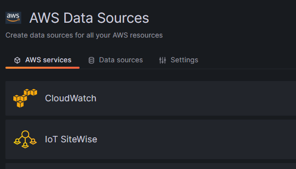

# Guidance for Self-Calibrating Level 4 Digital Twins on AWS with TwinFlow

## Table of Content

### Required

1. [Overview](#overview)
    - [Architecture](Architecture)
    - [Cost](#cost)
2. [Prerequisites](#prerequisites)
    - [Operating System](#operating-system)
3. [Deployment Steps](#deployment-steps)
4. [Deployment Validation](#deployment-validation)
5. [Running the Guidance](#running-the-guidance)
6. [Description of TwinFlow Script](#description-of-twinflow-script)
7. [Next Steps](#next-steps)
8. [Cleanup](#cleanup)


## Overview

Digital twins can be a powerful method to provide risk assessment, virtual sensors, scenario analysis, and process or design optimization.  However, digital twins are only as smart as the initial setup and assumptions used to develop them.  Hence, it is often (not always) better to combine a digital twin with measurments to modify either the assumptions internal to the digital twin or modify the predictions of the digital twin. 

This guide demonstrates both how to deploy the infrastructure needed to combine a IoT data with a physics based digital twin _and_ how to probablistically calibrate the digital twin with an Unscented Kalman Filter. 

Standard AWS CDK is used to deploy the infrastructure needed for scalable compute including an IoT database.  The opensource tool AWS [TwinFlow](https://github.com/aws-samples/twinflow) is used to achieve the self-calibration of the digital twin.  A blog discussing the overall concepts of this guide can be found [here](https://blog).

### Architecture
</br>
<center>

</center>
</br>

1. Users download TwinFlow from GitHub and install on their temporary Amazon EC2 interface
2. Users can modify the example containers for their specific application including embedding a digital twin inside the container. The example TwinFlow containers use probabilistic methods to calibrate the digital twin. 
3. Next, push the container to Amazon Elastic Container Registry to enable using the container by all AWS services.
4. Data from an edge location is ingested to  AWS IoT SiteWise
5. Using Amazon EventBridge scheduler, periodically deploy an Amazon EC2 instance in AWS Batch which loads the TwinFlow container and application customized code.
6. The TwinFlow container loads the AWS IoT SiteWise data, calibrates a digital twin, and stores the calibration in an Amazon S3 bucket.
7. Using an autoscaling EC2 in a AWS Batch compute environment, use the calibrated digital twin to make physics predictions
8. Upload the physics predictions into AWS IoT SiteWise enabling downstream consumption
9. Monitor the data in Amazon Managed Grafana with AWS IoT TwinMaker
10. Users can stop their initial Amazon EC2 instance as it is no longer needed. 

### Cost

You are responsible for the cost of the AWS services used while running this Guidance. As of 10/13/23, the cost for running this Guidance with the default settings in the us-east-1 is less than $10 per month.

The cost of this solution is mainly dependant on:

* The number of incoming IoT data streams
* Frequency of IoT data streams
* Runtime of the digital twin
* Number of variables being calibrated within the digital twin

In this specific example, discussed in depth [here](https://blog), we are using a small number of IoT datastreams (9 streams), being sampled at 20min intervals, and calibrating a medium/small number of variables (9 variables). Our digital twin has a runtime of around a few seconds. Thus, the actual monthly cost of this solution is less then $10/month.  Costs can dramatically change depending on modification of any of these dependancies.

## Prerequisites

### Operating System

While the solution has been tested with Linux on an EC2 instance, there is no reason Windows cannot be used.  AWS TwinFlow and AWS CDK are python applications that are OS independant.

The digital twin is embedded and deployed in a linux container, which also enables OS independance. 

### AWS account requirments

This solution assumes the user has IAM admin rights to their account and enables the deployment of a variety of AWS services within the account. 

### AWS CDK installation

Run the following commands to install CDK

This step installs the AWS command line options.
```
curl "https://awscli.amazonaws.com/awscli-exe-linux-x86_64.zip" -o "awscliv2.zip"
unzip awscliv2.zip
sudo ./aws/install
```
You can now run the command ```aws configure``` to setup the IAM permissions for your account on this specific EC2 instance. 


Now install npm:
```
curl -o- https://raw.githubusercontent.com/nvm-sh/nvm/v0.37.2/install.sh | bash
. ~/.nvm/nvm.sh
nvm install node
node -v
npm -v
```
Finally, install the cdk CLI:
```
npm install -g aws-cdk
```


## Deployment Steps:


1) Download and install the latest twinflow code: <br>     
```
git clone --recursive https://github.com/aws-samples/twinflow
pip install twinflow/twinstat/dist/*.whl
pip install twinflow/twinmodules/dist/*.whl
pip install twinflow/twingraph/dist/*.whl
```
2) Build and push containers to ECR

The example container ```Dockerfile-fmu-calibrater``` includes both building and installation of TwinFlow and embedding the example digital twin.  This digital twin is in the form of an FMU for this example.

If you are running on an EC2 instance in the cloud, you can use the small twinmodules cli to quickly build and push to your accounts AWS ECR. For example, the following command sets and alias for ease of running the commands: <br>
```
alias tfcli="python <path to twinflow>/twinmodules/twinmodules/tfcli.py"
```
The following command sets the region that you are in, in this example it is us-east-1, the docker tag "fmu-calibrate", and the actual docker file that needs to be built and then pushed up to AWS ECR.  Note that tfcli is looking for a full path and not only a file name.

```
tfcli -bp --region us-east-1 -t fmu-calibrate -d ./Dockerfile-fmu-calibrater
```

3) Review the user defined options in the ```iot_config.json```.  Note this file contains cloud specific configuration that need to be set based on your account configuration.  Such as the address for your container images, the account region, s3 bucket names, etc.  This file also includes the specific inputs and outputs for the FMU file that will need to be customized to your application.  You can also control numerical configuration for running the FMU such as step stize, solution converge tolerance, number of iterations to wait for convergence, etc. Notice that the exact address of the container in ECR will change depending on your account and thus, even if you are not trying to customize this guidance, you will need to update the address with your specific account number. 

</br>
<center>

</center>
</br>


3) Install python packages and deploy CDK IaC

We will be using the standard CDK package and additional features for AWS Batch that are still in an alpha release as of 2023. 

Install CDK Python packages:
```
pip install aws-cdk-lib
pip install aws-cdk.aws-batch-alpha
```

Deploy entire infrastructure. Note the cdk bootstrap command is only required once per initial account setup. The synth command generates a cloud formation yaml file.  The cdk deploy command executes the cloud formation yaml file.

```
cd FMUCalibrationStack
cdk bootstrap
cdk synth
cdk deploy
cd ..
```
While the CDK is being deployed, you can navigate in AWS Console to the CloudFormation page to obtain details on the progress/status/errors of the deployment. 

## Deployment Validation

* Within the AWS Console, open CloudFormation page and verify the status of the template with the name containing FMUCalibrationStack.
* If deployment is successful, you should see an active IoT SiteWise database, new S3 buckets, EventBridge rules, and AWS Batch compute environments. 


## Running the Guidance

1) Once you have completed the infrastructure deployment in the previous section, we will need to run a dummy data population script.  This script is simply uploading data in some increments to simulate IoT data being written to the IoT SiteWise database.

   In production, the user is expected to connect physical sensors to this database and you will _not_ need to run this dummy script during production operation.

   ```
   python PushSiteWiseData_startBatchPredictions.py
   ```

   In AWS Console, users can navigate to IoT SiteWise and watch the dummy script adding data to the database. 


   </br>
   <center>
   
   </center>
   </br>

   The default calibration time in the ```iot_config.json``` file is set to every 1min.  For this example, users should wait around 5-10min for the dummy data to be pushed up to SiteWise and for the TwinFlow Unscented Kalman Filter to pull the data, calibrate the digital twin, and push results back to SiteWise.

2) Next we need to setup user access to Grafana to review the data. 
   
   Setup SSO password access:
   In AWS Console, navigate to the "IAM Identity Center".  Create a user that you would like to provide access to the Grafana dashboard.  This user will be able to visually review all of the data we setup in the dashboard and customize the dashboard.

   Connect the user to Grafana:  In the AWS Console, navigate to the Grafana page. Select the newly made Grafana workspace generated by this Guidance. In the authentication tab, add the user we have just created.

   </br>
   <center>
   
   </center>
   </br>
   
   For the first user setup, we recommend making them an admin to ensure they can load the data and customize the dashboard.

   </br>
   <center>
   
   </center>
   </br>
      
   Enter into Grafana console: Now that we have both created an AWS Managed Grafana and added a user to the workspace, lets enter into Grafana by clicking the workspace URL:

   </br>
   <center>
   
   </center>
   </br>

   The username and password are for the user you created in the IAM Identity Center step.

3) Add a data source in Grafana: Before you can setup dashboards, we need to first connect Grafana to a specific data source. Click Home -> Apps -> AWS Data Sources 


   </br>
   <center>
   
   </center>
   </br>

An option for SiteWise should appear:

   </br>
   <center>
   
   </center>
   </br>

Select your region and add the data source. 

4) Generate a dashboard: We can run a dashboard generation script that will generate a yaml file specific to this Guidance example. 
   
   a) Run the python script "generate_dashboard_json.py" which will load the dashboard template and fill in the account specific information. A new dashboard json file ("generated_dashboard.json") will be generated.
   <br/>b) The generated json file can be imported directly into Grafana, which will define some panels and plot all of the inputs and results defined in the iot_config.json file.  This enables live review of the L4 calibration and the measured IoT data being ingested in IoT SiteWise. Note, depending on how you are running this guidance, you may have to FTP the yaml file back to your local machine to enable uploading to Grafana dashboard setup.


   </br>
   <center>
   
   </center>
   </br>


## Description of TwinFlow Script

The TwinFlow script, ```fmu_calibrate.py```, that is embedded in the container:

* Pulls data from IoT SiteWise
* Sets up an Unscented Kalman Filter (UKF) in which the transition function is the digital twin
* Runs the UKF in parallel to probabalistically determine the inferred variables within the digital twin
* Uses the UKF inferred variables in the digital twin to make predictions about many unmeasured variabls
* Pushes these predictions (i.e. virtual sensors), the UKF mean value of the inferred variables, and the uncertainty of the inferred variables back into the IoT SiteWise database.

The first step in the script is for TwinFlow to determine the unique metadata information for all assets deployed during the CDK steps.


   </br>
   <center>
   
   </center>
   </br>

Next, TwinFlow downloads the data from IoT SiteWise for the variables provided in the ```iot_config.json``` file.  The exact database ID for sitewise was determined in the previous metadata step. The SiteWise database relates timeseries data and attributes based on asset IDs. Using TwinFlow, we can automatically determine what these values are instead of manually trying to figure them out in the AWS Console. The last step of the the ```get_data()``` function is ensuring all pulled data is temporally syncronized.  

   </br>
   <center>
   
   </center>
   </br>

With the newly downloaded data, we can combine the Unscented Kalman Filter and the IoT data to calibrate the digital twin.  Users who are customizing this guidance for their own applications will need to experiement and "design" the matrices for the process noise and the measurment noise.  Users should conceptually think of the process noise as the minimum allowable step size for the UKF purturbations and the mesurement noise as coefficient that provides numerically stability but also determines the level of trust in the incoming data.  

If a user is ensure where to start for their application, consider starting the measurment noise with the observed variance in the incoming IoT data. 

TwinFlow utilizes an S3 Bucket to save the current state of the UKF to peristent storage.  Hence, each time a new calibration worker is generated in AWS Batch, TwinFlow will look for an archieved file in an S3 bucket restart the filering.  

UKF uses "black box" functions for both the transition function and observation function.  TwinFlow UKF is an object with default functions that exhibit a linear assumption.  In this example, we do not overwrite the observation function as a linear assumption is reasonable.  However, we would like to call the digital twin for each transition function execution. Thus, in this example we create our own function that includes any algorithm a user desires.  Here, we include coefficient clips for stability, we use TwinFlow to execute the FMU and return the values back to the UKF. Notice, that this digital twin is run transiently and TwinFlow will determine when convergence has been achieved terminating the simulation.  

   </br>
   <center>
   
   </center>
   </br>
   
After the digital twin has been calibrated by the UKF, the digital twin is used to make predictions serving as a virtual sensor for many unmeasured variables. This step is performed in the ```make_prediction``` function in the TwinFlow script. The variables used for the virtual sensors are defined in the ```iot_config.json``` file. The final step is to again use TwinFlow auto determine the variable names and property/asset IDs in SiteWise and push back up to the database.

Notice that the uncertainty bands are each their own property in SiteWise.  The damping coefficient b2 has a property ID in SiteWise, but in addition, the lower and upper bounds also each have their own property ID.  These are then displayed in Grafana with formatting changes.

## Next Steps

Users can familarize themselves with each of the steps on the guidance and determine how they would like to customize them for their applications.

Key areas to customize for a different application are:

* The digital twin embedded in the containers
* Parameters in the TwinFLow calibration script
* json inputs


## Clean Up

The solution can be removed from a user's account by either opening up the EC2 instance and navigating back to the CDK directory (FMUCalibrationStack). Within this directory run the command:

```
cdk destroy
```

An alternative is to use the AWS Console.  Navigate to the CloudFormation page and find the FMUCalibrationStack Stack.  Select the delete stack option and the CloudFormation automation will remove all infrastructure deployed specifically in this stack.  

Note any S3 Buckets created in this guidance need to be manually deleted as a data safety precaution.  These buckets will continue to incur costs until deleted. 

## Security 

See [CONTRIBUTING](CONTRIBUTING.md#security-issue-notifications) for more information.


## License

This library is licensed under the MIT-0 License. See the LICENSE file.
